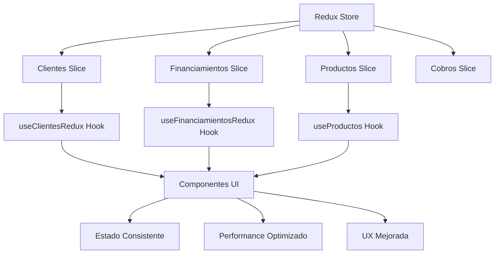

# 🦈 Los Tiburones - Sistema de Gestión Financiera

<div align="center">
  


**Sistema completo de gestión de financiamientos, cobranza e inventario**

[🚀 Demo](#demo) • [📖 Documentación](#documentación) • [⚡ Instalación](#instalación) • [🏗️ Arquitectura](#arquitectura)

</div>

---

## 📋 Descripción

**Los Tiburones** es un sistema integral de gestión financiera diseñado para empresas que manejan financiamientos a cuota, cobranza y control de inventario. Desarrollado con **Next.js 14**, **TypeScript**, **Redux Toolkit** y **Firebase**, ofrece una experiencia de usuario moderna y una arquitectura robusta.

## ✨ Funcionalidades Principales

### 🔐 Sistema de Autenticación y Autorización

- **Roles de Usuario:** Admin, Manager, Cajero, Cobrador
- **Permisos Granulares:** Control detallado de accesos por módulo
- **Seguridad:** Middleware de autenticación y protección de rutas

### 👥 Gestión de Clientes

- ✅ **CRUD Completo** con validación de cédula única
- ✅ **Búsqueda Avanzada** por nombre, teléfono, cédula, dirección
- ✅ **Historial de Financiamientos** por cliente
- ✅ **Geolocalización** con integración Google Maps
- ✅ **Gestión de Documentos** (fotos de cédula)

### 💰 Sistema de Financiamientos

- **Tipos de Venta:** Contado y Cuotas
- ✅ **Financiamientos Múltiples** (varios productos por financiamiento)
- ✅ **Cálculo Automático** de cuotas y fechas
- ✅ **Estados Dinámicos:** activo, completado, atrasado
- ✅ **Seguimiento Completo** del progreso de pagos

### 📊 Sistema de Cobranza

- ✅ **Registro de Pagos** con múltiples tipos de pago
- ✅ **Validación de Comprobantes** anti-duplicados
- ✅ **Identificación Automática** de cuotas atrasadas
- ✅ **Clasificación de Riesgo** (baja, media, alta, crítica)
- ✅ **Notificaciones WhatsApp** para contacto directo

### 📦 Gestión de Inventario

- ✅ **Control de Stock** con niveles mínimos
- ✅ **Categorización** de productos
- ✅ **Galería de Imágenes** por producto
- ✅ **Actualización Automática** de stock en ventas

### 📈 Estadísticas y Reportes

- ✅ **Dashboards Específicos** por rol
- ✅ **Métricas en Tiempo Real** de cobranza
- ✅ **Análisis de Financiamientos** y productos
- ✅ **Reportes Detallados** exportables

## 🚀 Tecnologías

### Frontend

- **Next.js 14** - App Router con React Server Components
- **TypeScript** - Tipado estático completo
- **Tailwind CSS** - Diseño responsive y moderno
- **Redux Toolkit** - Gestión de estado optimizada

### Backend & Base de Datos

- **Firebase Firestore** - Base de datos NoSQL en tiempo real
- **Firebase Auth** - Autenticación segura
- **Firebase Storage** - Almacenamiento de archivos

### Herramientas de Desarrollo

- **ESLint** - Linting de código
- **Prettier** - Formateo automático
- **Husky** - Git hooks para calidad de código

## ⚡ Instalación

### Prerrequisitos

- Node.js 18.0 o superior
- npm, yarn, pnpm o bun
- Cuenta de Firebase

### 1. Clonar el Repositorio

```bash
git clone https://github.com/tu-usuario/store-app-ve.git
cd store-app-ve
```

### 2. Instalar Dependencias

```bash
npm install
# o
yarn install
# o
pnpm install
```

### 3. Configurar Variables de Entorno

```bash
cp .env.example .env.local
```

Edita `.env.local` con tu configuración de Firebase:

```env
NEXT_PUBLIC_FIREBASE_API_KEY=tu_api_key
NEXT_PUBLIC_FIREBASE_AUTH_DOMAIN=tu_auth_domain
NEXT_PUBLIC_FIREBASE_PROJECT_ID=tu_project_id
NEXT_PUBLIC_FIREBASE_STORAGE_BUCKET=tu_storage_bucket
NEXT_PUBLIC_FIREBASE_MESSAGING_SENDER_ID=tu_sender_id
NEXT_PUBLIC_FIREBASE_APP_ID=tu_app_id
```

### 4. Ejecutar en Desarrollo

```bash
npm run dev
# o
yarn dev
# o
pnpm dev
```

Abre [http://localhost:3000](http://localhost:3000) en tu navegador.

## 🏗️ Arquitectura

### Estructura del Proyecto

```
src/
├── app/                    # App Router (Next.js 14)
│   ├── clientes/          # Gestión de clientes
│   ├── financiamiento-cuota/ # Sistema de financiamientos
│   ├── inventario/        # Control de inventario
│   └── cobranza/          # Sistema de cobranza
├── components/            # Componentes reutilizables
│   ├── ui/               # Componentes UI base
│   ├── clientes/         # Componentes específicos de clientes
│   ├── financiamiento/   # Componentes de financiamientos
│   └── inventario/       # Componentes de inventario
├── hooks/                # Custom hooks optimizados
│   ├── useClientesRedux.ts
│   ├── useFinanciamientosRedux.ts
│   └── useProductos.ts
├── store/                # Redux Toolkit store
│   ├── index.ts          # Configuración del store
│   └── slices/           # Slices de Redux
├── lib/                  # Configuraciones y utilidades
│   ├── firebase/         # Configuración Firebase
│   └── utils/            # Funciones utilitarias
├── services/             # Servicios de negocio
└── types/                # Definiciones de tipos TypeScript
```

### Arquitectura Redux Optimizada



### Beneficios de la Arquitectura

- ✅ **Estado Global Consistente** - Una sola fuente de verdad
- ✅ **Performance Optimizado** - Suscripciones eficientes
- ✅ **Componentes Puros** - Fácil testing y reutilización
- ✅ **TypeScript Completo** - Seguridad de tipos
- ✅ **Escalabilidad** - Arquitectura modular

## 🔧 Scripts Disponibles

```bash
# Desarrollo
npm run dev          # Servidor de desarrollo
npm run build        # Build de producción
npm run start        # Servidor de producción
npm run lint         # Linting con ESLint
npm run type-check   # Verificación de tipos

# Testing (si está configurado)
npm run test         # Ejecutar tests
npm run test:watch   # Tests en modo watch
```

## 📱 Funcionalidades por Rol

### 👑 Admin

- Acceso completo al sistema
- Gestión de usuarios y permisos
- Configuración del sistema
- Todos los reportes y estadísticas

### 👨‍💼 Manager

- Gestión operativa completa
- Supervisión de cobranza
- Reportes ejecutivos
- Gestión de inventario

### 💰 Cajero

- Transacciones de financiamiento
- Gestión de clientes
- Registro de pagos
- Consulta de inventario

### 📞 Cobrador

- Solo cobranza y consultas
- Contacto con clientes
- Reportes de cobranza
- Consulta de estados de cuenta

## 🎨 Características de UX/UI

- **📱 Responsive Design** - Mobile-first approach
- **🎨 Design System** - Componentes consistentes
- **⚡ Performance** - Lazy loading y optimizaciones
- **♿ Accesibilidad** - Estándares WCAG
- **🌙 Tema Moderno** - Gradientes y efectos suaves

## 🔒 Seguridad

- **🔐 Autenticación Firebase** - Segura y escalable
- **🛡️ Middleware de Protección** - Rutas protegidas por rol
- **✅ Validación de Datos** - Client-side y server-side
- **🔒 Permisos Granulares** - Control de acceso detallado

## 📊 Performance

- **⚡ Next.js 14** - App Router con RSC
- **🚀 Redux Toolkit** - Estado optimizado
- **📦 Code Splitting** - Carga bajo demanda
- **🖼️ Optimización de Imágenes** - Next.js Image optimization
- **💾 Caché Inteligente** - Suscripciones Firebase optimizadas

## 🤝 Contribución

1. Fork el proyecto
2. Crea una rama para tu feature (`git checkout -b feature/AmazingFeature`)
3. Commit tus cambios (`git commit -m 'Add some AmazingFeature'`)
4. Push a la rama (`git push origin feature/AmazingFeature`)
5. Abre un Pull Request

## 📄 Licencia

Este proyecto está bajo la Licencia MIT. Ver `LICENSE` para más detalles.

## 👨‍💻 Desarrollador

**CodeXYZ Development**

- 📧 Email: [contacto@codexyz.dev](mailto:contacto@codexyz.dev)
- 🌐 Website: [codexyz.dev](https://codexyz.dev)

---

<div align="center">

**🦈 Los Tiburones - Gestión Financiera Inteligente**

_Desarrollado con ❤️ usando Next.js, TypeScript y Redux Toolkit_

[⬆ Volver al inicio](#-los-tiburones---sistema-de-gestión-financiera)

</div>
